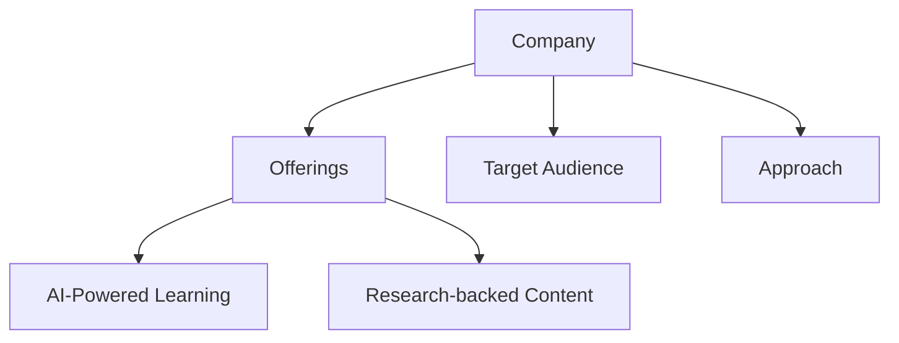
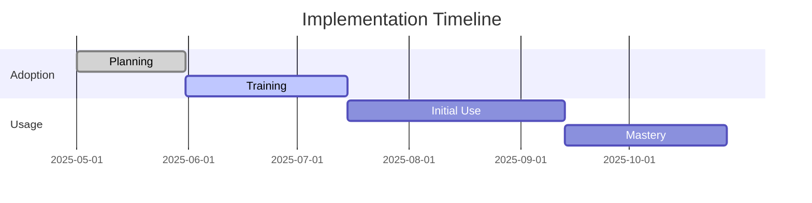
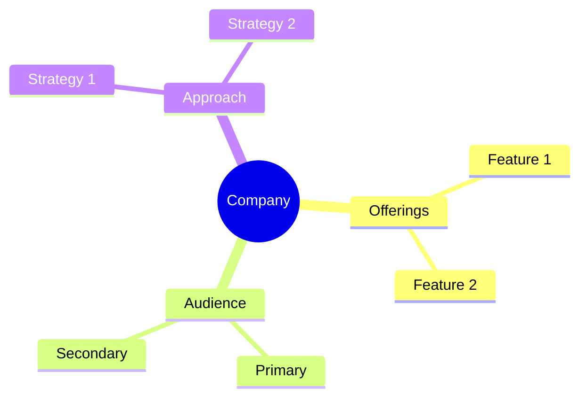

<!-- Mermaid support for diagrams, flowcharts, and Gantt charts -->
<!-- Usage examples:

-->
# AI Adoption and Learning Platform Research
## Executive Summary

This research repository contains comprehensive analysis of leading AI-powered learning and coaching platforms, with a focus on how they address generational differences, psychological barriers to AI adoption, and effective implementation strategies.

## Key Companies Analyzed
- **HoneHQ**: Live, interactive learning platform
- **CoachHub**: AI-powered digital coaching platform
- **SectionAI** (formerly Section School): AI-specific curriculum
- **WorkHelix**: AI workforce development
- **Wildsparq**: Team-based leadership development
- **SuccessCOACHING**: Customer success training
- **Dale Carnegie Training**: Traditional leadership training
- **FranklinCovey**: Leadership development
- **iSpring Learn**: Digital learning platform

## Core Research Areas
1. **AI Adoption Barriers**
   - Skill Gaps
   - Cultural Resistance
   - Implementation Challenges

2. **Generational Learning Differences**
   - Baby Boomers
   - Generation X
   - Millennials
   - Generation Z

3. **Psychological Components**
   - Behavioral Reinforcement
   - Habit Formation
   - Change Management

4. **Market Analysis**
   - Market Share
   - Growth Metrics
   - Pricing Comparison
   - Client Profiles

## Recommendations
Based on comprehensive analysis, recommendations for different organizational needs are provided, focusing on the best solutions for specific use cases and requirements.

*Last Updated: May 11, 2025*
