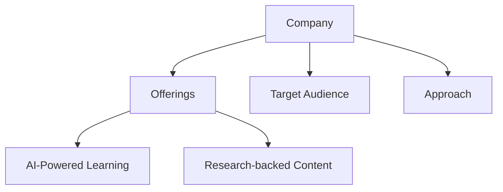
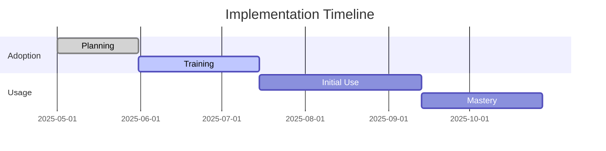
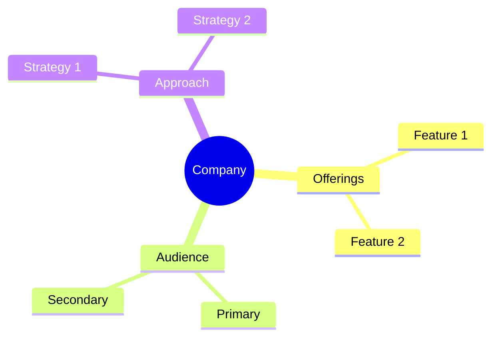

<!-- Mermaid support for diagrams, flowcharts, and Gantt charts -->
<!-- Usage examples:

-->
# HoneHQ Company Profile

## Overview
HoneHQ provides live, interactive learning experiences for employee development through a combination of AI-powered tools and expert coaching.

## Key Offerings
- **AI-Powered Learning**: Scale training with technology that automates communications and scheduling, AI coaching and class suggestions, and dashboards to track progress.
- **Research-backed Content**: Extensive catalog of learning experiences for the whole team, from manager training to individual contributor development.
- **Live, Interactive Experiences**: Variety of live online learning experiences designed to reinforce skills and led by subject matter expert coaches.
- **Performance Data**: Impact Analysis to understand training's high-level impacts and identify specific skill improvements.

## Target Audience
- Senior leaders
- Managers
- First-time managers
- Individual contributors

## Learning Approach
HoneHQ emphasizes live, interactive learning experiences combined with AI-powered tools to deliver a comprehensive employee development solution.

## AI Integration
- AI-powered scheduling and communications
- AI coaching and recommendations
- Analytics and progress tracking

## Generational Approach
HoneHQ provides a balanced approach that combines traditional live learning with modern AI tools, making it suitable for various generational learning preferences.

## Pricing Model
Custom pricing based on organizational needs and number of users.

## Market Position
HoneHQ positions itself as an all-in-one employee development partner, focusing on delivering effective learning experiences across the organization.

*Last Updated: May 11, 2025*
