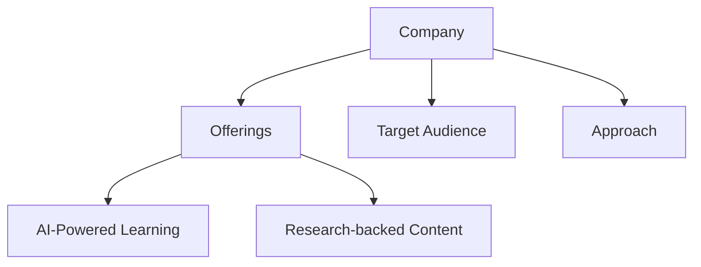
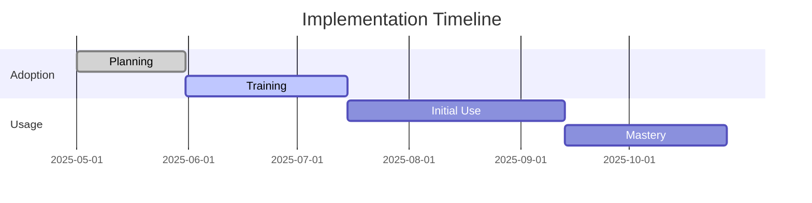
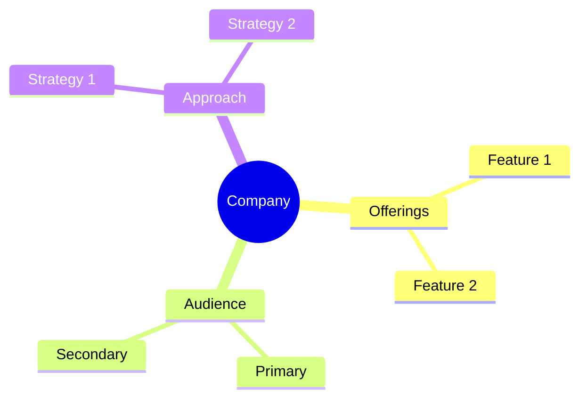

<!-- Mermaid support for diagrams, flowcharts, and Gantt charts -->
<!-- Usage examples:

-->
# CoachHub Company Profile

## Overview
CoachHub is the leading global digital coaching platform, empowering organizations to create scalable and measurable personalized coaching programs for their entire workforce.

## Key Offerings
- **AI-Powered Coaching**: AIMY™ AI coach provides 24/7 personalized coaching
- **Live Coaching**: Global pool of 3,500+ certified business coaches
- **Comprehensive Platform**: Digital platform for scheduling, tracking, and measuring impact
- **Behavioral Science Based**: Programs built on research-backed methodologies

## Target Audience
- Enterprise organizations
- Global workforces
- All levels of employees (executive to entry-level)

## Learning Approach
CoachHub combines AI-powered coaching with human coaching expertise to deliver personalized development at scale.

## AI Integration
- AIMY™ AI coach for 24/7 support
- CoachHub Companion for between-session guidance
- Analytics and progress tracking
- Personalized learning paths

## Generational Approach
CoachHub's AI-driven platform allows for personalized learning experiences tailored to different generational preferences and learning styles.

## Psychological Components
- Change management support
- Growth mindset development
- Behavioral reinforcement
- Habit formation

## Pricing Model
- Basic: ~$50-75 per user/month
- Standard: ~$75-125 per user/month
- Premium: ~$125-200 per user/month
- Annual commitment required
- Minimum 50 users

## Market Position
- Revenue: $231.2M (2024)
- Customers: 100M+
- Funding: $200M Series C (2022)
- Global market leader in digital coaching

## Growth Metrics
- 100%+ annual growth rate
- 50%+ customer base growth
- Strong customer retention

*Last Updated: May 11, 2025*
