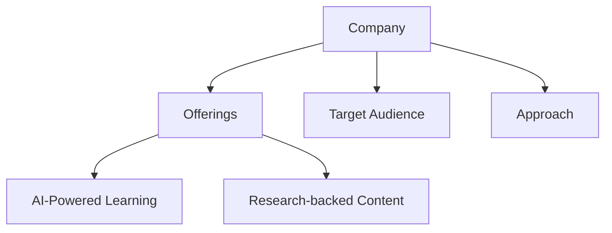
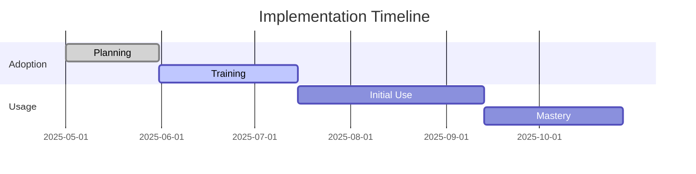
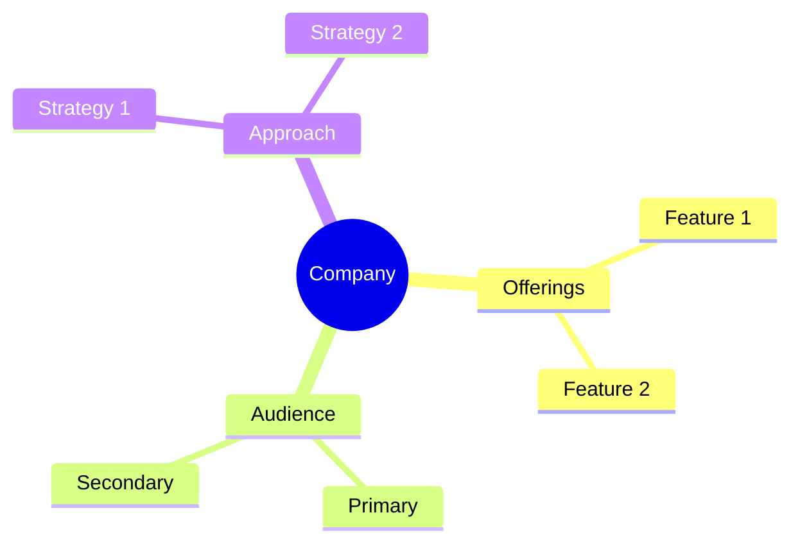

<!-- Mermaid support for diagrams, flowcharts, and Gantt charts -->
<!-- Usage examples:

-->
# SectionAI (formerly Section School) Company Profile

## Overview
SectionAI is a specialized AI education platform founded by Scott Galloway, focused on building the essential "AI for business" curriculum to equip working professionals for success in the age of AI.

## Key Offerings
- **AI Academy**: Comprehensive AI curriculum and certification
- **AI Crash Course**: Rapid AI learning for professionals
- **AI Class Certificate**: Skills certification for the "AI class"
- **AI-Powered Coach**: Personalized feedback and guidance

## Target Audience
- Business professionals
- Knowledge workers
- Individuals seeking AI skills
- Organizations preparing for AI transformation

## Learning Approach
SectionAI focuses on practical, skill-based learning specifically designed for AI adoption and implementation in business contexts.

## AI Integration
- AI-powered coaching
- AI certification
- Hands-on AI training
- Practical application

## Generational Approach
SectionAI's approach focuses on dividing the workforce into the "AI class" (those embracing AI) versus those who don't, rather than traditional generational divisions.

## Psychological Components
- Skill-based confidence building
- Practical application
- Certification for validation
- Expert-led training

## Pricing Model
- Course-based pricing
- Membership options
- Certificate programs
- Enterprise solutions

## Market Position
- Specialized in AI-specific education
- Founded by prominent business educator Scott Galloway
- Focused on bridging the AI skills gap
- Building the "AI class" of knowledge workers

## Unique Value Proposition
SectionAI uniquely positions itself as creating the dividing line between the "AI class" and those who haven't embraced AI, focusing specifically on business applications rather than technical development.

*Last Updated: May 11, 2025*
