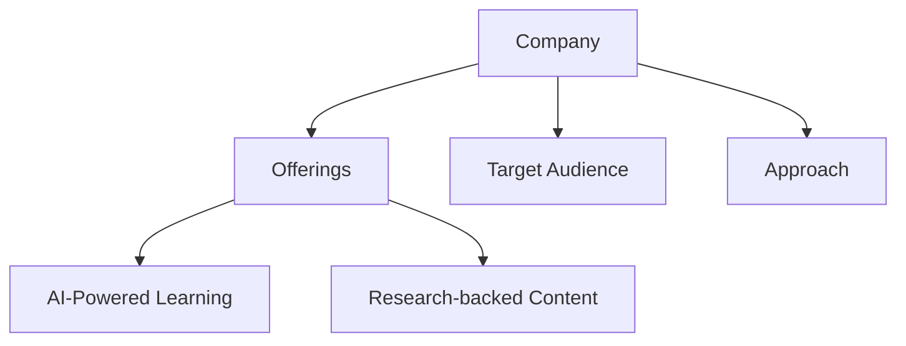
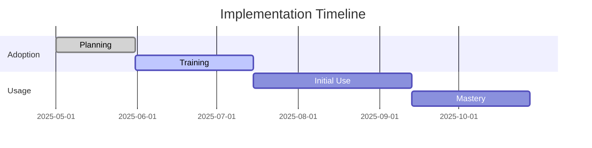
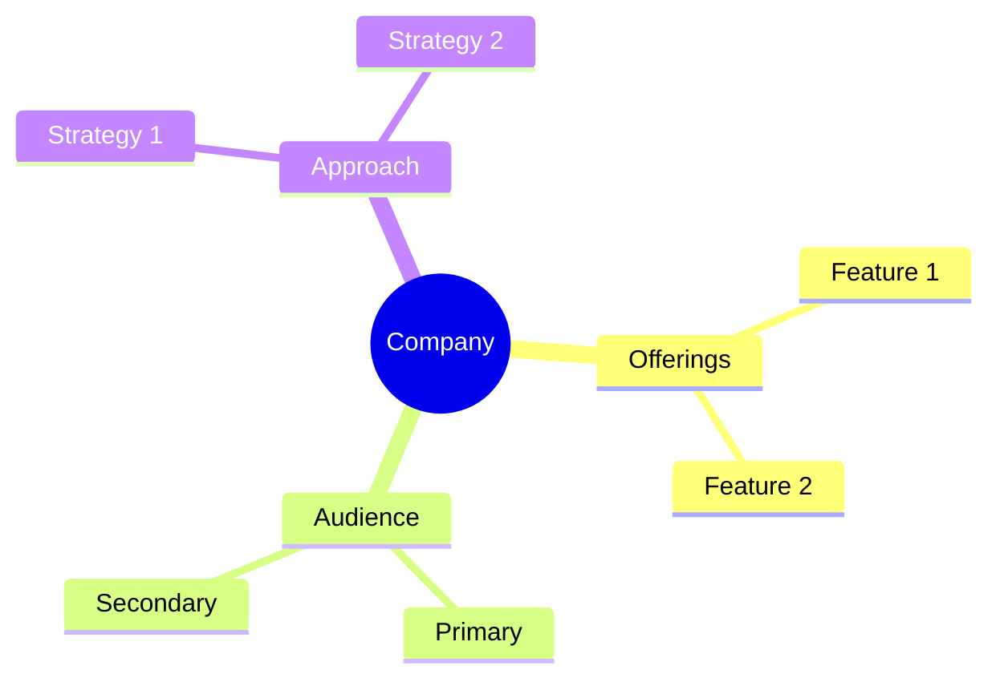

<!-- Mermaid support for diagrams, flowcharts, and Gantt charts -->
<!-- Usage examples:

-->
# WorkHelix Company Profile

## Overview
WorkHelix is an AI workforce development platform that helps organizations prepare their workforces for generative AI implementation and adoption.

## Key Offerings
- **AI Impact Analysis**: Reveals true benefits of AI investments
- **Task-Oriented Learning**: Studies AI effect on specific workforce tasks
- **Integration with LMS**: Works with existing learning management systems
- **Vendor-Agnostic Content**: Selects learning materials from multiple sources

## Target Audience
- Enterprise organizations
- Workforce development leaders
- HR and L&D professionals
- Digital transformation teams

## Learning Approach
WorkHelix takes a task-oriented approach, analyzing how generative AI affects specific workforce tasks and developing targeted learning paths.

## AI Integration
- AI impact analysis
- Task-specific learning
- Advanced AI model for content selection
- Data science and machine learning integration

## Generational Approach
WorkHelix focuses on role and task-based analysis rather than generational differences, creating learning paths based on job requirements.

## Psychological Components
- Change management for AI adoption
- Task-specific confidence building
- Practical application
- Measurable outcomes

## Market Position
- Strategic investment from Accenture
- Integration with Accenture LearnVantage
- Focus on workforce preparation for generative AI
- Data-driven approach to AI skills development

## Unique Value Proposition
WorkHelix uniquely focuses on revealing the true benefits of AI investments while preparing workforces for effective AI implementation through task-specific learning paths.

*Last Updated: May 11, 2025*
