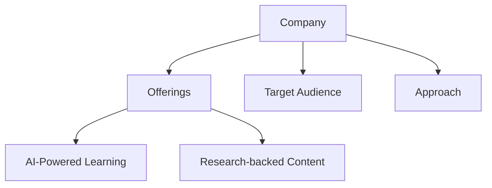
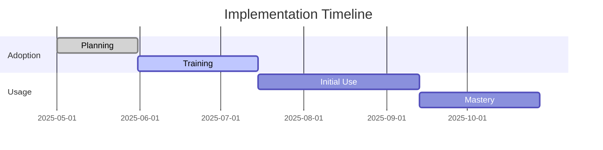
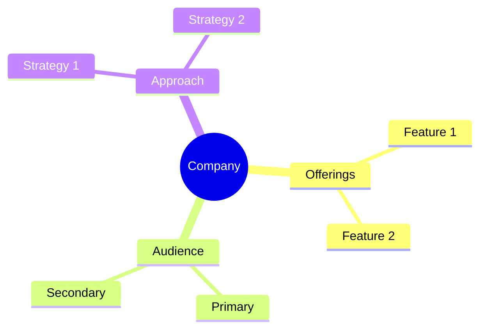

<!-- Mermaid support for diagrams, flowcharts, and Gantt charts -->
<!-- Usage examples:

-->
# Wildsparq Company Profile

## Overview
Wildsparq is a team-based leadership development platform that provides personalized development plans and interactive monthly lessons for effective leadership training.

## Key Offerings
- **Personalized Leadership Development**: 90-day action plans based on assessments
- **Team-Based Development**: Interactive monthly lessons and team meetings
- **360° Assessments**: Comprehensive baseline evaluations
- **Leadership Resource Library**: Dynamic resources for continuous learning

## Target Audience
- Mid-market companies
- Leadership teams
- Current and future leaders
- Teams of 8+ members

## Learning Approach
Wildsparq emphasizes team-based learning and cross-generational collaboration, focusing on shared learning experiences and peer-to-peer development.

## AI Integration
- Assessment analysis
- Personalized learning paths
- Progress tracking
- Resource recommendations

## Generational Approach
Wildsparq's team-based approach naturally addresses generational differences through collaborative learning, allowing different generations to learn from each other.

## Psychological Components
- Team dynamics analysis
- Group behavior patterns
- Collaborative learning
- Shared goals and accountability

## Pricing Model
- Small Team (8-14 users): $55 per user/month
- Medium Team (15-29 users): ~$45-50 per user/month
- Large Team (30+ users): Custom pricing
- Annual commitment required

## Market Position
- Rapidly growing challenger in leadership development
- Strong market traction
- High growth rate (50-70% annually)
- Strong in tech and professional services

## Unique Value Proposition
Wildsparq uniquely focuses on team-based leadership development with a turnkey monthly plan and 360-degree development approach that aligns with organizational values and goals.

*Last Updated: May 11, 2025*
