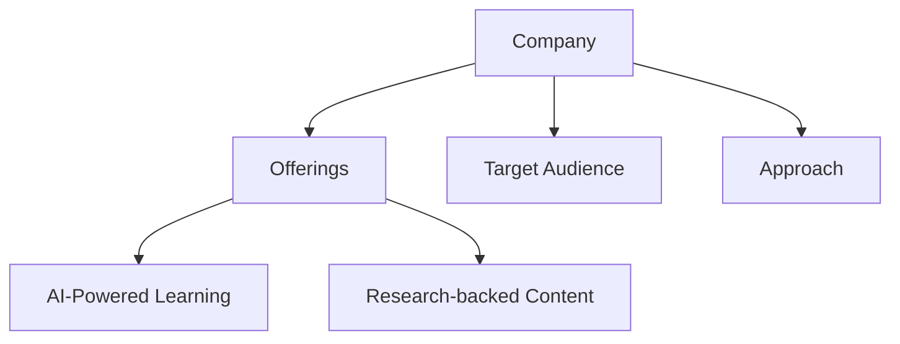
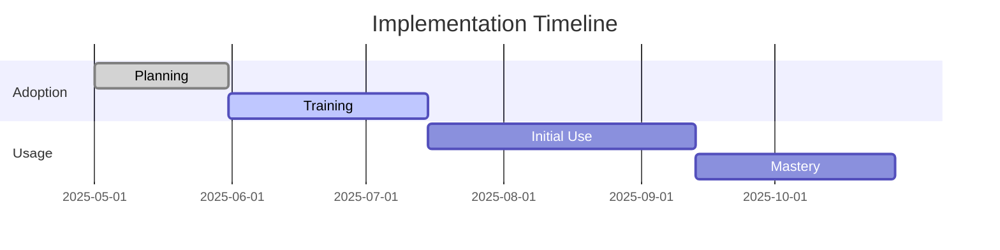
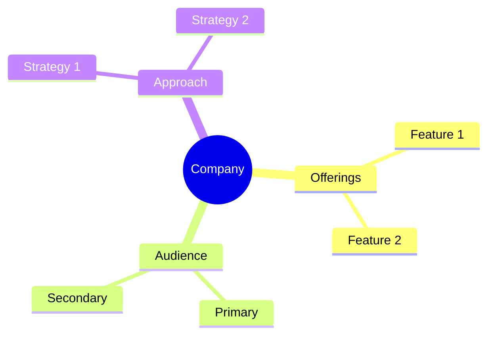

<!-- Mermaid support for diagrams, flowcharts, and Gantt charts -->
<!-- Usage examples:

-->
# SuccessCOACHING Company Profile

## Overview
SuccessCOACHING provides specialized training and coaching for customer success professionals, focusing on developing essential skills for delivering better outcomes for customers and companies.

## Key Offerings
- **12-Week Coaching Programs**: Comprehensive customer success training
- **All-Access Bundle**: Complete resource access for teams
- **Solo Subscriptions**: Individual professional development
- **Bootcamps**: Intensive training programs

## Target Audience
- Customer Success Managers (CSMs)
- Customer Success teams
- SaaS companies
- Technology organizations

## Learning Approach
SuccessCOACHING provides role-based learning with a focus on customer success practices, combining self-paced learning with live coaching sessions.

## AI Integration
- Moderate AI integration
- Learning path recommendations
- Progress tracking
- Resource suggestions

## Generational Approach
SuccessCOACHING focuses on professional role and experience level rather than generational differences, creating learning paths based on career stage.

## Psychological Components
- Role-specific confidence building
- Professional development focus
- Career progression support
- Skill validation

## Pricing Model
- 12-week program: $1,695 (~$141/month)
- All-Access Bundle: $1,295 per person
- Hybrid coaching option: $1,795
- Team discounts available

## Market Position
- Strong niche player in customer success
- High client engagement
- 30-50% annual growth rate
- Strong in SaaS and technology industries

## Unique Value Proposition
SuccessCOACHING uniquely focuses on customer success training with proven methodologies and expert instructors, providing comprehensive development for customer success professionals.

*Last Updated: May 11, 2025*
