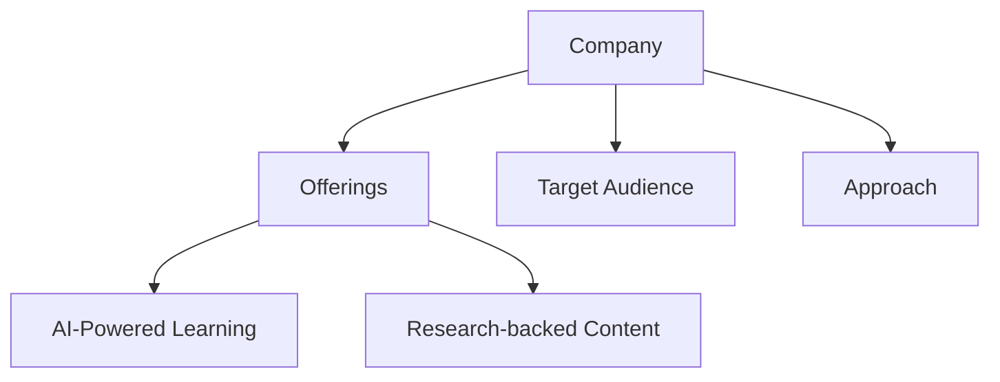
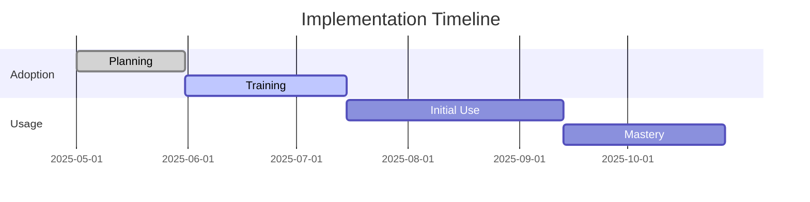
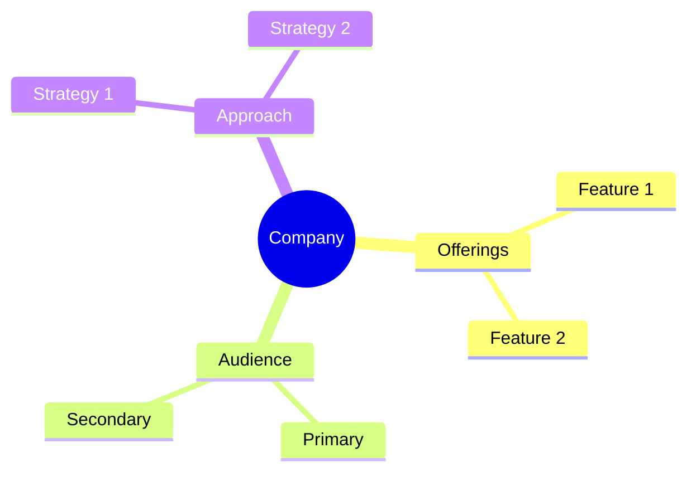

<!-- Mermaid support for diagrams, flowcharts, and Gantt charts -->
<!-- Usage examples:

-->
# Dale Carnegie Training Company Profile

## Overview
Dale Carnegie Training is a well-established leadership development organization with a long history of providing proven training methodologies for professional and personal development.

## Key Offerings
- **Leadership Training**: Comprehensive leadership development programs
- **Professional Development**: Skills-based training for career advancement
- **Communication Training**: Interpersonal and professional communication
- **Corporate Solutions**: Customized organizational training

## Target Audience
- Corporate professionals
- Leaders and managers
- Sales professionals
- Organizations of all sizes

## Learning Approach
Dale Carnegie emphasizes traditional, structured learning with proven methodologies and time-tested approaches to professional development.

## AI Integration
- Limited AI integration
- Traditional methodologies
- Established practices
- Human-led instruction

## Generational Approach
Dale Carnegie's traditional approach resonates particularly well with Baby Boomers and older Generation X professionals who value structured, proven methodologies.

## Psychological Components
- Established principles
- Proven methodologies
- Traditional values
- Time-tested approaches

## Market Position
- Established market leader
- Long-standing reputation
- Global presence
- Trusted brand

## Unique Value Proposition
Dale Carnegie uniquely offers time-tested, proven methodologies for professional development with a long history of success and a global reputation for quality.

*Last Updated: May 11, 2025*
