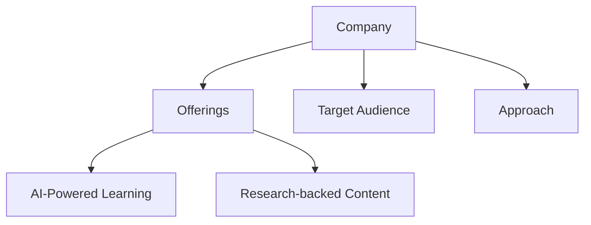
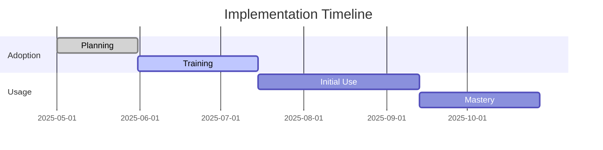
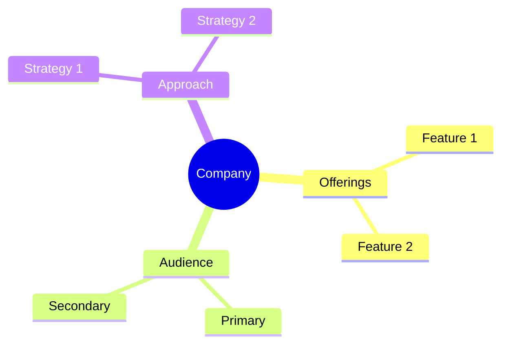

<!-- Mermaid support for diagrams, flowcharts, and Gantt charts -->
<!-- Usage examples:

-->
# FranklinCovey Company Profile

## Overview
FranklinCovey is a global leadership development organization that focuses on transforming organizations through proven principles of leadership, execution, productivity, and personal effectiveness.

## Key Offerings
- **Leadership Development**: Comprehensive leadership training programs
- **Organizational Execution**: Implementation and execution frameworks
- **Personal Effectiveness**: Individual development and productivity
- **Corporate Training**: Custom organizational solutions

## Target Audience
- Corporate leaders
- Executives
- Management teams
- Large enterprises

## Learning Approach
FranklinCovey emphasizes leadership development and professional growth through established principles and methodologies for organizational and personal effectiveness.

## AI Integration
- Limited AI integration
- Established methodologies
- Proven principles
- Human-led instruction

## Generational Approach
FranklinCovey's approach is based on timeless leadership principles that appeal across generations, with a structured approach that particularly resonates with experienced professionals.

## Psychological Components
- Leadership principles
- Professional values
- Career progression
- Leadership development

## Market Position
- Established market leader
- Global presence
- Strong brand recognition
- Enterprise focus

## Unique Value Proposition
FranklinCovey uniquely offers leadership development based on timeless principles and proven methodologies with a focus on organizational transformation and effectiveness.

*Last Updated: May 11, 2025*
