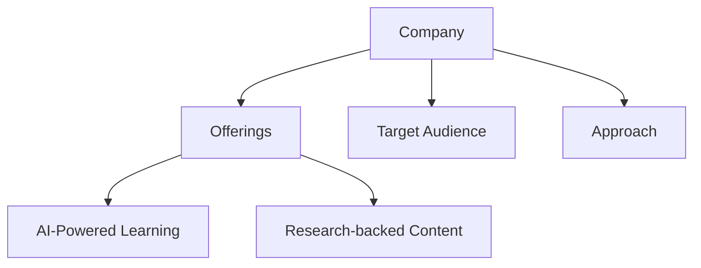
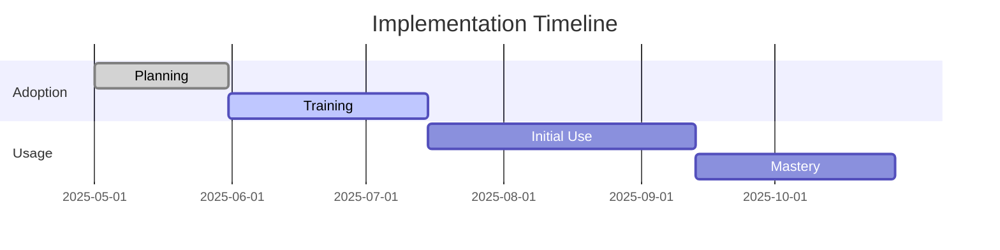
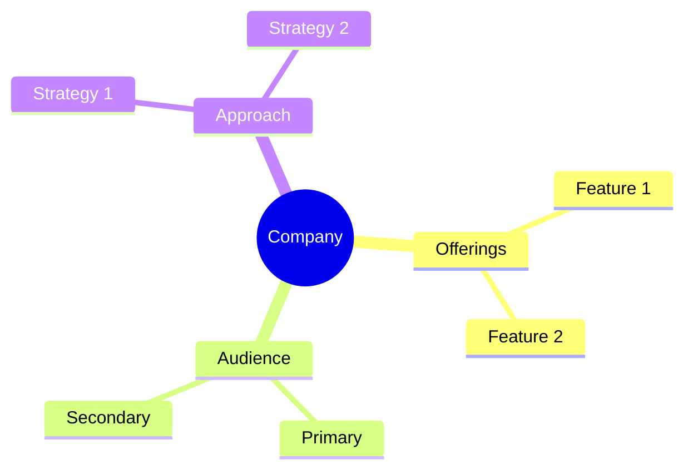

<!-- Mermaid support for diagrams, flowcharts, and Gantt charts -->
<!-- Usage examples:

-->
# iSpring Learn Company Profile

## Overview
iSpring Learn is a cloud-based Learning Management System (LMS) that facilitates efficient corporate training and development with AI-powered features.

## Key Offerings
- **AI-Powered Course Creation**: Automated content development tools
- **Corporate Training**: Onboarding, compliance, and customer service training
- **Extensive Customization**: Branded learning portals
- **Learning Analytics**: Comprehensive tracking and reporting

## Target Audience
- Corporate training departments
- HR professionals
- Digital learning teams
- Medium to large organizations

## Learning Approach
iSpring Learn emphasizes technology-based learning with a digital-first approach, focusing on efficient content delivery and tracking.

## AI Integration
- AI-powered course creation
- Automated content generation
- Learning analytics
- Personalized recommendations

## Generational Approach
iSpring Learn's digital-first approach naturally appeals to Millennials and Generation Z learners who prefer technology-driven learning experiences.

## Psychological Components
- Technology preferences
- Digital learning styles
- Self-paced progression
- Achievement recognition

## Market Position
- Growing player in LMS market
- Technology-focused solution
- Digital learning specialist
- AI integration leader

## Unique Value Proposition
iSpring Learn uniquely combines AI-powered course creation with extensive customization capabilities and comprehensive analytics to deliver efficient corporate training solutions.

*Last Updated: May 11, 2025*
