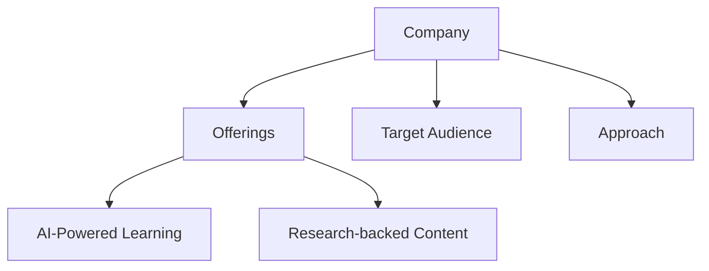
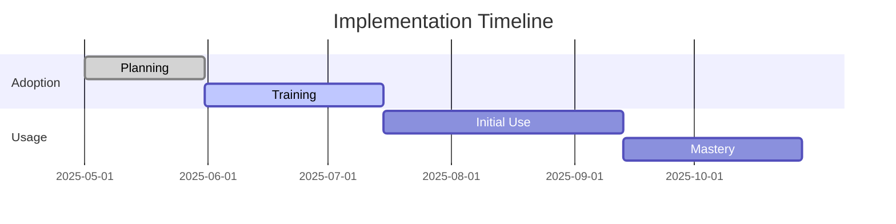
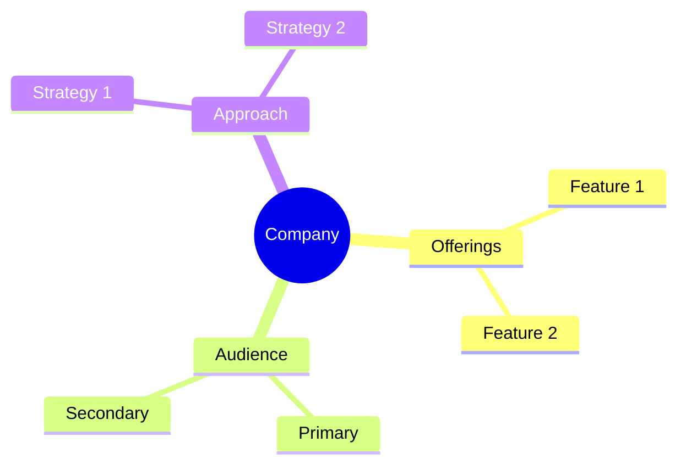

<!-- Mermaid support for diagrams, flowcharts, and Gantt charts -->
<!-- Usage examples:

-->
# Market Position Analysis

## Overall Market Leaders

| Company | Market Position | Revenue | Customer Base | Growth Rate |
|---------|----------------|---------|---------------|-------------|
| CoachHub | Global Leader | $231.2M (2024) | 100M+ | 100%+ |
| FranklinCovey | Established Leader | Not Disclosed | Global Enterprise | Steady |
| Dale Carnegie | Traditional Leader | Not Disclosed | Global Presence | Steady |
| HoneHQ | Growing Challenger | Not Disclosed | Enterprise Focus | High |
| SectionAI | AI Specialist | Not Disclosed | Growing Rapidly | Very High |

## Growth Metrics Comparison

| Company | Annual Growth Rate | Customer Base Growth | Revenue Growth |
|---------|-------------------|----------------------|----------------|
| CoachHub | 100%+ | 50%+ | 100%+ |
| SectionAI | 70-100%+ | 60-80%+ | 70-100%+ |
| Wildsparq | 50-70% | 40-60% | 50-70% |
| WorkHelix | 50-70% | 40-60% | 50-70% |
| SuccessCOACHING | 30-50% | 20-30% | 30-50% |
| iSpring Learn | 30-50% | 20-30% | 30-50% |
| HoneHQ | 30-50% | 20-30% | 30-50% |
| FranklinCovey | 10-20% | 5-15% | 10-20% |
| Dale Carnegie | 5-15% | 5-10% | 5-15% |

## Funding and Investment

| Company | Latest Funding | Total Funding | Investors |
|---------|---------------|---------------|-----------|
| CoachHub | $200M Series C (2022) | $300M+ | Sofina, SoftBank Vision Fund 2 |
| WorkHelix | Strategic Investment | Undisclosed | Accenture |
| SectionAI | Undisclosed | Undisclosed | Undisclosed |
| Wildsparq | Undisclosed | Undisclosed | Undisclosed |
| HoneHQ | Undisclosed | Undisclosed | Undisclosed |

## Market Specialization

| Company | Primary Focus | Secondary Focus | Target Market |
|---------|--------------|-----------------|---------------|
| CoachHub | Digital Coaching | AI Integration | Enterprise Global |
| SectionAI | AI Education | Business Skills | Professionals |
| WorkHelix | AI Workforce Prep | Task Analysis | Enterprise |
| Wildsparq | Leadership Dev | Team Building | Mid-Market |
| SuccessCOACHING | Customer Success | Professional Dev | Tech/SaaS |
| Dale Carnegie | Leadership | Communication | Corporate |
| FranklinCovey | Leadership | Execution | Enterprise |
| iSpring Learn | Digital Learning | Corporate Training | Corporate |
| HoneHQ | Employee Dev | Live Learning | Enterprise |

## Customer Satisfaction Metrics

| Company | Satisfaction Rate | Retention Rate | Key Metrics |
|---------|-------------------|---------------|-------------|
| CoachHub | Very High (93%+) | Very High | Success Rate, NPS |
| Wildsparq | High | High | Completion Rate, ROI |
| SuccessCOACHING | High | High | Engagement, Impact |
| FranklinCovey | High | Very High | Impact, Longevity |
| Dale Carnegie | High | Very High | Legacy, Impact |
| SectionAI | Very High | High | Skill Acquisition |
| WorkHelix | High | High | AI Readiness |
| iSpring Learn | High | Medium-High | Completion Rate |
| HoneHQ | High | High | Engagement Rate |

*Last Updated: May 11, 2025*
