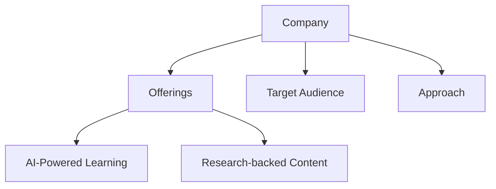
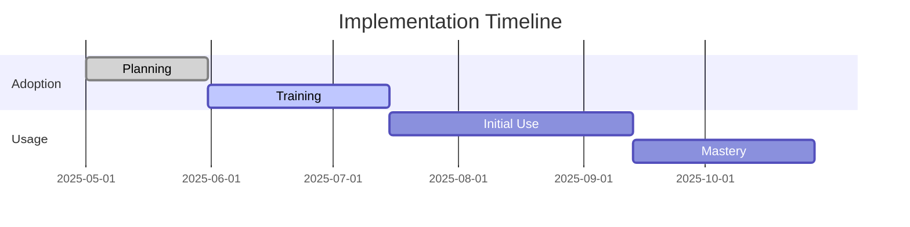
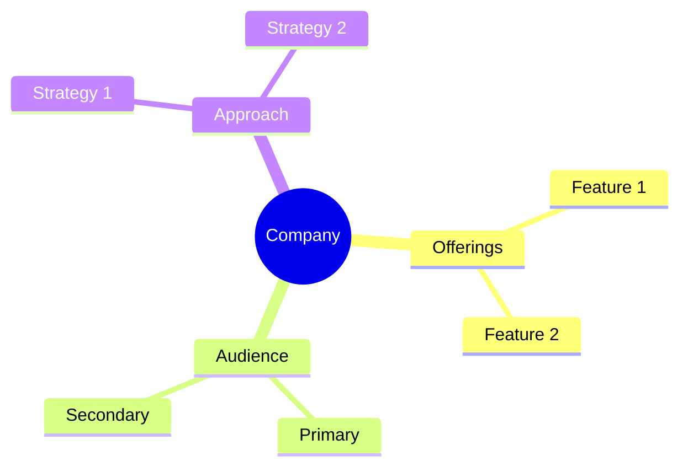

<!-- Mermaid support for diagrams, flowcharts, and Gantt charts -->
<!-- Usage examples:

-->
# Pricing Comparison

## Enterprise Pricing Models

| Company | Small Team (10 users) | Medium Team (50 users) | Large Team (100+ users) | Commitment |
|---------|----------------------|------------------------|-------------------------|------------|
| CoachHub | $500-750/month | $2,500-6,250/month | $5,000-20,000/month | Annual |
| Wildsparq | $550/month | $2,250-2,500/month | Custom | Annual |
| HoneHQ | Custom | Custom | Custom | Custom |
| SuccessCOACHING | $1,410/month (solo) | Custom | Custom | Optional |
| WorkHelix | Custom | Custom | Custom | Custom |
| FranklinCovey | Custom | Custom | Custom | Annual |
| Dale Carnegie | Custom | Custom | Custom | Custom |
| iSpring Learn | Custom | Custom | Custom | Annual |
| SectionAI | Course-based | Custom for Enterprise | Custom for Enterprise | Course-based |

## Individual and Course-Based Pricing

| Company | Individual Access | Certification | Course-Based | Bundle Options |
|---------|------------------|---------------|--------------|----------------|
| SuccessCOACHING | $1,695 (12-week) | Included | Available | $1,295 All-Access |
| SectionAI | Available | Available | Available | Academy Membership |
| CoachHub | Not Available | Not Available | Not Available | Not Available |
| Wildsparq | Not Available | Not Available | Not Available | Not Available |
| Dale Carnegie | Available | Available | Available | Available |
| FranklinCovey | Available | Available | Available | Available |

## Value Analysis

| Company | Cost-Effectiveness | Volume Discounts | Feature Value | ROI Metrics |
|---------|-------------------|------------------|---------------|-------------|
| CoachHub | Medium-High | Significant | Highest | Strong |
| SectionAI | High for AI Skills | Available | High for AI | Strong |
| Wildsparq | High | Available | High for Teams | Strong |
| SuccessCOACHING | High for CS Teams | Available | High for CS | Strong |
| WorkHelix | Medium-High | Available | High for AI Prep | Strong |
| FranklinCovey | Medium | Available | High for Leadership | Proven |
| Dale Carnegie | Medium | Available | High for Leadership | Proven |
| iSpring Learn | Medium-High | Available | High for Digital | Strong |
| HoneHQ | Medium-High | Available | High for Live Learning | Strong |

## Key Pricing Considerations

### Commitment Requirements
- **Annual Required**: CoachHub, Wildsparq, FranklinCovey, iSpring Learn
- **Flexible Options**: SuccessCOACHING, SectionAI, Dale Carnegie
- **Custom Terms**: WorkHelix, HoneHQ

### Minimum User Requirements
- **High (50+)**: CoachHub
- **Medium (8-15)**: Wildsparq
- **Low (1-5)**: SuccessCOACHING, SectionAI
- **Custom**: WorkHelix, HoneHQ, FranklinCovey, Dale Carnegie, iSpring Learn

### Hidden Costs
- **Implementation Fees**: Possible with most enterprise solutions
- **Content Creation**: Additional for customization
- **Support Tiers**: Premium support often additional
- **Feature Access**: Advanced features often in higher tiers

## Recommendations Based on Budget

### Enterprise Budget ($50K+/year)
- **Best Overall Value**: CoachHub
- **Best for Leadership**: FranklinCovey
- **Best for AI Readiness**: WorkHelix

### Mid-Market Budget ($20-50K/year)
- **Best Overall Value**: Wildsparq
- **Best for Teams**: Wildsparq
- **Best for Live Learning**: HoneHQ

### Small Budget ($5-20K/year)
- **Best Overall Value**: SuccessCOACHING
- **Best for Customer Success**: SuccessCOACHING
- **Best for AI Skills**: SectionAI

### Individual Budget ($1-5K/year)
- **Best Overall Value**: SectionAI
- **Best for Customer Success**: SuccessCOACHING
- **Best for Leadership**: Dale Carnegie courses

*Last Updated: May 11, 2025*
