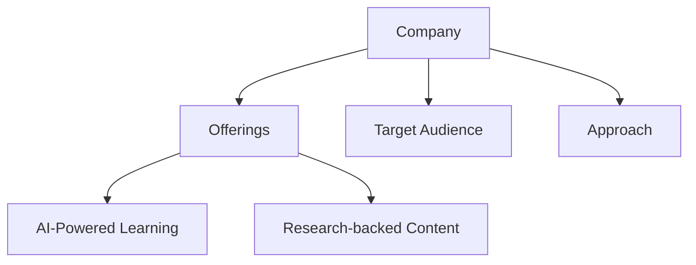
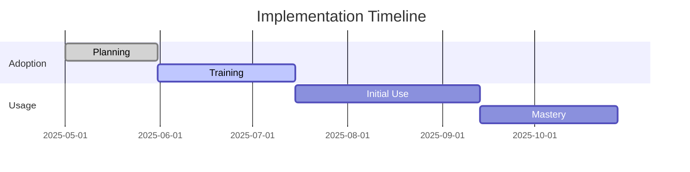
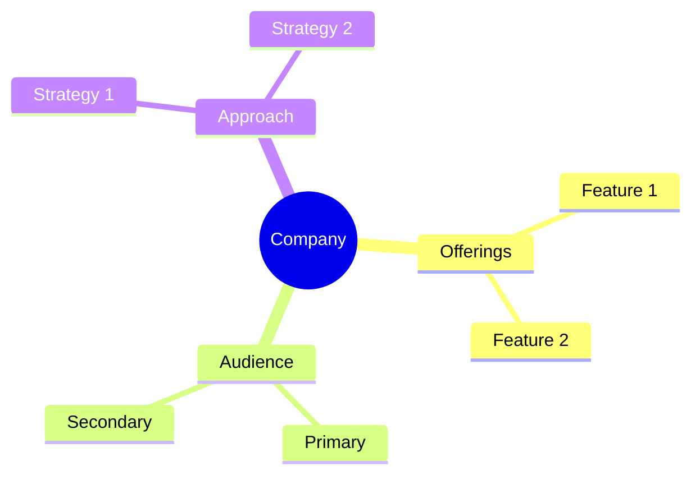

<!-- Mermaid support for diagrams, flowcharts, and Gantt charts -->
<!-- Usage examples:

-->
# Generational Learning Analysis

## Generational Learning Differences

| Generation | Learning Preferences | Technology Comfort | Key Motivators | Effective Approaches |
|------------|---------------------|-------------------|----------------|----------------------|
| Baby Boomers | Structured, formal | Variable | Respect, recognition | Traditional, expert-led |
| Generation X | Independent, practical | Moderate | Work-life balance, autonomy | Balanced, flexible |
| Millennials | Collaborative, feedback-driven | High | Purpose, development | Technology-enhanced, social |
| Generation Z | Digital-native, on-demand | Very High | Innovation, personalization | Digital-first, personalized |

## Company Approaches to Generational Learning

| Company | Primary Approach | Generational Focus | Adaptability | Key Strategy |
|---------|-----------------|-------------------|--------------|--------------|
| CoachHub | Personalized AI | All Generations | Very High | AI-powered personalization |
| SectionAI | AI-Class Focused | Skill-Based | Medium | AI skill development |
| WorkHelix | Task-Oriented | Role-Based | Medium-High | Task analysis and adaptation |
| Wildsparq | Team-Based | Cross-Generational | High | Collaborative learning |
| SuccessCOACHING | Role-Based | Professional Stage | Medium | Career stage adaptation |
| Dale Carnegie | Traditional | Boomers, Gen X | Low | Proven methodologies |
| FranklinCovey | Leadership Principles | Experienced Professionals | Medium | Timeless principles |
| iSpring Learn | Digital-First | Millennials, Gen Z | Medium-High | Technology integration |
| HoneHQ | Balanced Hybrid | All Generations | High | Live learning with AI |

## Best Fit by Generation

### Baby Boomers (Born 1946-1964)
1. **Dale Carnegie**: Traditional, structured approach
2. **FranklinCovey**: Leadership principles and methodology
3. **HoneHQ**: Live, expert-led learning

### Generation X (Born 1965-1980)
1. **Wildsparq**: Team-based, balanced approach
2. **SuccessCOACHING**: Practical, role-based learning
3. **FranklinCovey**: Leadership development focus

### Millennials (Born 1981-1996)
1. **CoachHub**: Technology with personalization
2. **iSpring Learn**: Digital learning experience
3. **SectionAI**: AI skill development

### Generation Z (Born 1997-2012)
1. **SectionAI**: Digital-native AI approach
2. **iSpring Learn**: Technology-first learning
3. **CoachHub**: AI-enhanced personalization

## Multi-Generational Strategies

| Company | Multi-Generational Approach | Effectiveness | Key Feature |
|---------|----------------------------|---------------|-------------|
| CoachHub | AI personalization for all | Very High | AIMY™ adaptive coaching |
| Wildsparq | Cross-team collaboration | High | Team-based learning |
| HoneHQ | Live learning with technology | High | Expert coaches with AI |
| WorkHelix | Task-focused adaptation | Medium-High | Role-based learning |
| FranklinCovey | Universal principles | Medium | Timeless frameworks |

## Psychographic Approaches

### Learning Styles Addressed

| Learning Style | Best Companies | Key Features |
|---------------|---------------|--------------|
| Visual | CoachHub, iSpring Learn | AI visual aids, interactive content |
| Auditory | CoachHub, Wildsparq | Audio coaching, discussions |
| Kinesthetic | Wildsparq, SuccessCOACHING | Interactive, practical training |
| Reading/Writing | FranklinCovey, Dale Carnegie | Traditional materials, frameworks |

### Professional Stages Addressed

| Career Stage | Best Companies | Key Features |
|--------------|---------------|--------------|
| Entry-Level | SectionAI, iSpring Learn | Skill building, certification |
| Mid-Career | Wildsparq, SuccessCOACHING | Team leadership, specialization |
| Senior | CoachHub, FranklinCovey | Executive coaching, strategy |
| Transition | WorkHelix, CoachHub | Skill adaptation, new capabilities |

## Recommendations for Multi-Generational Workforces

1. **Most Comprehensive**: CoachHub
   - AI personalization adapts to individual preferences
   - Support for all learning styles
   - Effective across generations

2. **Best for Team Diversity**: Wildsparq
   - Team-based approach bridges generations
   - Collaborative learning environment
   - Shared experiences build understanding

3. **Best Traditional + Modern Balance**: HoneHQ
   - Live learning appeals to older generations
   - AI integration appeals to younger generations
   - Expert-led with technology enhancement

4. **Best for AI Transition**: WorkHelix
   - Task-focused approach transcends generations
   - Practical application for all ages
   - Focuses on skills rather than age groups

*Last Updated: May 11, 2025*
