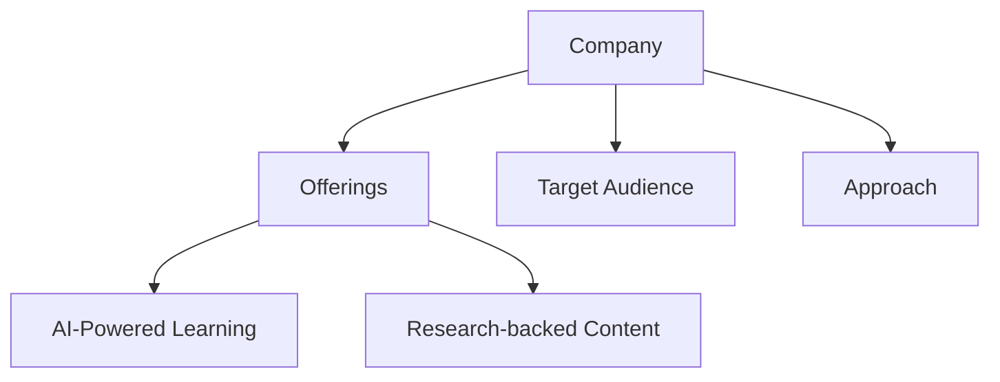
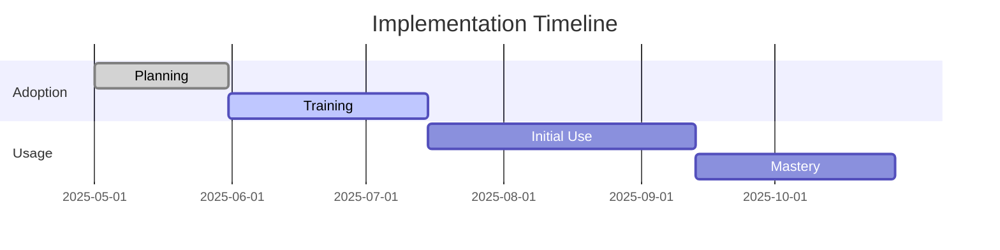
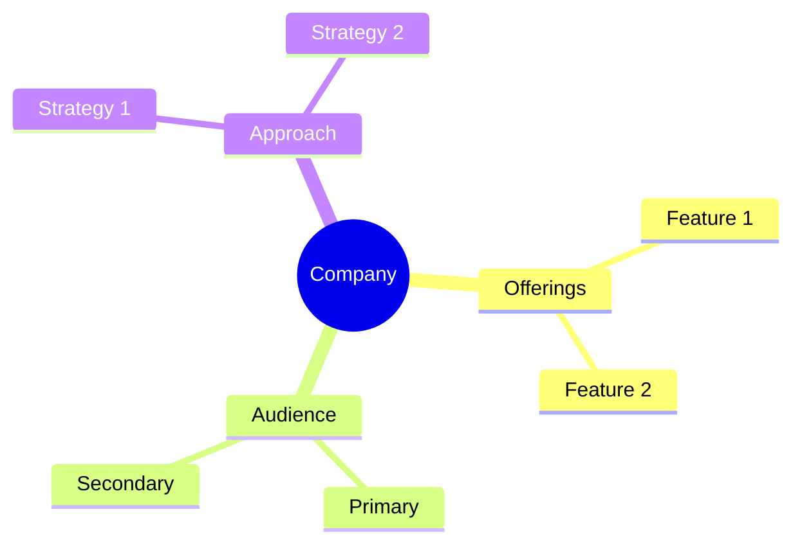

<!-- Mermaid support for diagrams, flowcharts, and Gantt charts -->
<!-- Usage examples:

-->
# AI Integration Analysis

## Level of AI Integration

| Company | AI Integration Level | Key AI Features | AI Approach | Unique Capabilities |
|---------|---------------------|----------------|-------------|---------------------|
| CoachHub | Highest | AIMY™, Companion, Analytics | Personalization | 24/7 AI coaching |
| SectionAI | Very High | AI curriculum, AI coach | Skill-focused | AI certification |
| WorkHelix | High | AI impact analysis, Task adaptation | Analysis-driven | AI workforce preparation |
| iSpring Learn | Medium-High | Course creation, Analytics | Content-focused | AI content generation |
| HoneHQ | Medium-High | Scheduling, Recommendations | Augmentation | AI-enhanced coaching |
| Wildsparq | Medium | Assessments, personalization | Team-focused | Team dynamics analysis |
| SuccessCOACHING | Medium | Recommendations, tracking | Role-focused | Customer success AI |
| FranklinCovey | Low-Medium | Analytics, assessments | Traditional+ | Framework application |
| Dale Carnegie | Low | Basic analytics | Traditional | Human-centered |

## AI Applications in Learning

| AI Application | Leading Companies | Implementation Approach | Effectiveness |
|----------------|-------------------|------------------------|---------------|
| Personalized Learning | CoachHub, SectionAI | Individual adaptation | Very High |
| Content Generation | iSpring Learn, CoachHub | AI-created resources | High |
| Progress Analytics | CoachHub, WorkHelix | Advanced metrics | Very High |
| Learning Recommendations | CoachHub, HoneHQ | Smart suggestions | High |
| Skill Assessment | WorkHelix, SectionAI | Capability analysis | High |
| Behavioral Analysis | CoachHub, Wildsparq | Pattern recognition | High |
| Knowledge Reinforcement | SectionAI, CoachHub | Spaced repetition | High |

## AI for Specific Learning Goals

| Learning Goal | Best AI Solutions | Companies | Implementation |
|---------------|-------------------|-----------|----------------|
| AI Adoption | AI-focused curriculum | SectionAI, WorkHelix | Specialized training |
| Leadership Development | AI-enhanced coaching | CoachHub, Wildsparq | Personalized guidance |
| Skill Acquisition | AI-driven practice | SectionAI, iSpring Learn | Interactive learning |
| Behavior Change | AI coaching | CoachHub, Wildsparq | Continuous reinforcement |
| Performance Improvement | Analytics + Coaching | CoachHub, WorkHelix | Data-driven development |
| Knowledge Retention | Reinforcement learning | SectionAI, CoachHub | Smart review systems |
| Team Collaboration | Group analytics | Wildsparq, CoachHub | Team dynamics insights |

## AI and Behavioral Reinforcement

| Company | Behavioral Approach | Key Features | Effectiveness |
|---------|---------------------|--------------|---------------|
| CoachHub | Comprehensive | AIMY™, tracking, feedback | Highest |
| SectionAI | Skill-focused | Certification, practice | High for skills |
| Wildsparq | Team-based | Group accountability | High for teams |
| WorkHelix | Task-oriented | Role adaptation | High for roles |
| HoneHQ | Live + AI | Expert verification | Medium-High |
| SuccessCOACHING | Role-specific | Professional habits | Medium-High |
| iSpring Learn | Digital-first | Completion tracking | Medium |
| FranklinCovey | Principle-based | Framework application | Medium |
| Dale Carnegie | Traditional | Practice-based | Medium |

## AI for Overcoming Adoption Barriers

### Addressing Skill Gaps

| Company | Approach to Skill Gaps | AI Implementation | Effectiveness |
|---------|------------------------|------------------|---------------|
| SectionAI | Direct skill building | AI certification | Highest |
| WorkHelix | Task-specific training | AI impact analysis | Very High |
| CoachHub | Personalized development | AIMY™ coaching | Very High |
| iSpring Learn | Content-focused learning | AI course creation | High |
| HoneHQ | Live skill development | AI-enhanced practice | High |

### Addressing Cultural Resistance

| Company | Approach to Cultural Resistance | AI Implementation | Effectiveness |
|---------|--------------------------------|------------------|---------------|
| CoachHub | Psychological support | Change management, guidance | Highest |
| Wildsparq | Team-based adoption | Group dynamics, shared experience | High |
| WorkHelix | Role value demonstration | Task impact analysis | High |
| SectionAI | Skill confidence building | Practical application, validation | High |
| HoneHQ | Expert validation | Human + AI approach | Medium-High |

## Recommendations for AI Adoption

1. **Best for Comprehensive AI Adoption**: CoachHub
   - Most advanced AI integration
   - Psychological and behavioral support
   - Personalized approach to adoption

2. **Best for AI-Specific Skills**: SectionAI
   - Specialized AI curriculum
   - Certification and validation
   - AI skill development focus

3. **Best for Organizational AI Readiness**: WorkHelix
   - Workforce analysis
   - Task-specific adaptation
   - Role-based preparation

4. **Best for Team-Based AI Adoption**: Wildsparq
   - Collaborative learning
   - Shared experiences
   - Group accountability

5. **Best for Balanced AI + Human Approach**: HoneHQ
   - Expert-led learning
   - AI enhancement
   - Live validation

*Last Updated: May 11, 2025*
