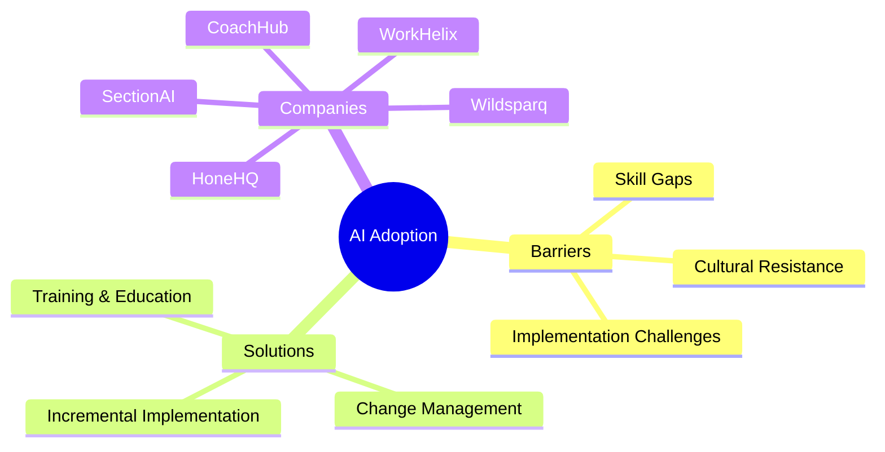
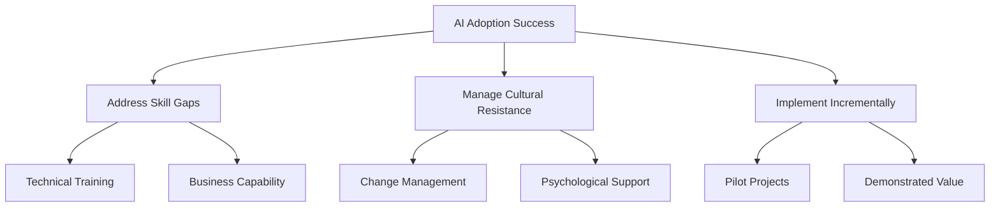
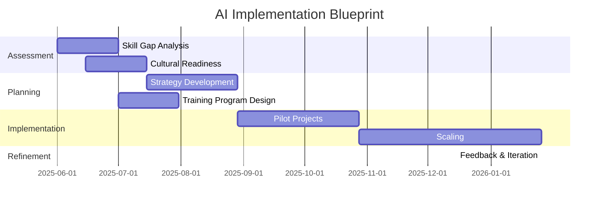

# AI Adoption Research & Analysis


## Overview

This repository contains comprehensive research and analysis on AI adoption strategies, focusing on the psychological components, skill gaps, and cultural resistance factors that impact successful AI implementation in organizations.



## Research Focus

The research explores several key areas impacting AI adoption:

- **Psychological Barriers**: Understanding and addressing resistance to change
- **Skill Development**: Bridging technical and business capability gaps
- **Implementation Strategies**: Best practices for successful AI integration
- **Generational Differences**: Adapting approaches across different age groups
- **Market Analysis**: Comparing leading AI learning and coaching platforms

## Companies Analyzed

This research provides detailed profiles and comparative analysis of leading platforms:

| Company | Primary Focus | Key Differentiator | Target Audience |
|---------|---------------|-------------------|-----------------|
| HoneHQ | Live learning | Expert coaching | Enterprise teams |
| CoachHub | AI coaching | AIMY™ AI assistant | Global workforce |
| SectionAI | AI education | "AI Class" curriculum | Knowledge workers |
| WorkHelix | AI readiness | Workforce analysis | Enterprise transformation |
| Wildsparq | Leadership | Team-based development | Mid-market companies |
| SuccessCOACHING | Customer success | Role specialization | CS professionals |
| Dale Carnegie | Traditional training | Proven methodologies | Corporate leaders |
| FranklinCovey | Leadership principles | Time-tested frameworks | Enterprise leaders |
| iSpring Learn | Digital learning | AI course creation | Corporate training |

## Repository Structure

```
📁 Research
├── 📁 01_Executive_Summary
│   └── 📄 overview.md
├── 📁 02_Company_Profiles
│   ├── 📄 01_HoneHQ.md
│   ├── 📄 02_CoachHub.md
│   ├── 📄 03_SectionAI.md
│   ├── 📄 04_WorkHelix.md
│   ├── 📄 05_Wildsparq.md
│   ├── 📄 06_SuccessCOACHING.md
│   ├── 📄 07_Dale_Carnegie.md
│   ├── 📄 08_FranklinCovey.md
│   └── 📄 09_iSpring_Learn.md
├── 📁 03_Comparative_Analysis
│   ├── 📄 01_Market_Position.md
│   ├── 📄 02_Pricing_Comparison.md
│   ├── 📄 03_Generational_Learning.md
│   └── 📄 04_AI_Integration.md
└── 📁 04_AI_Adoption_Research
```

## Key Findings



## Implementation Timeline



## Recommendations

Based on our comprehensive analysis, organizations should:

1. **Start with assessment** to identify specific skill gaps and cultural barriers
2. **Choose appropriate platforms** based on organizational needs and culture
3. **Implement incrementally** with pilot projects demonstrating clear value
4. **Provide continuous support** addressing both technical and psychological needs
5. **Measure impact** using both quantitative and qualitative metrics

## License

This research is available for educational and reference purposes.

*Last Updated: May 11, 2025*
